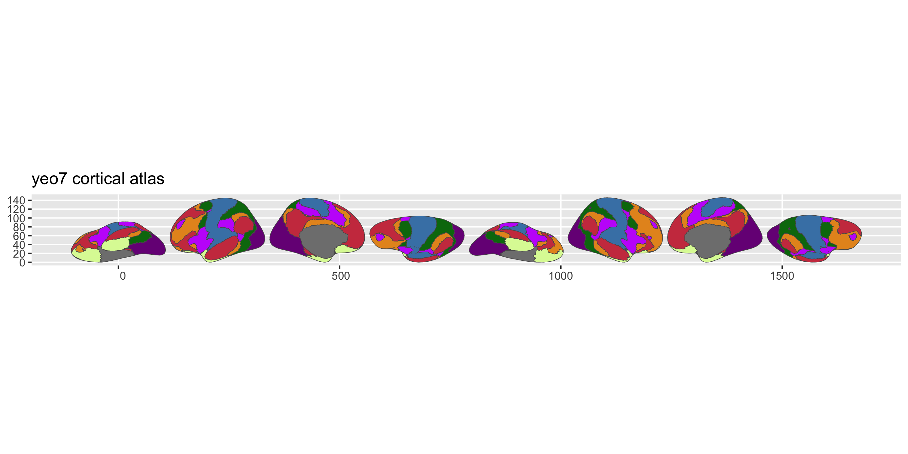
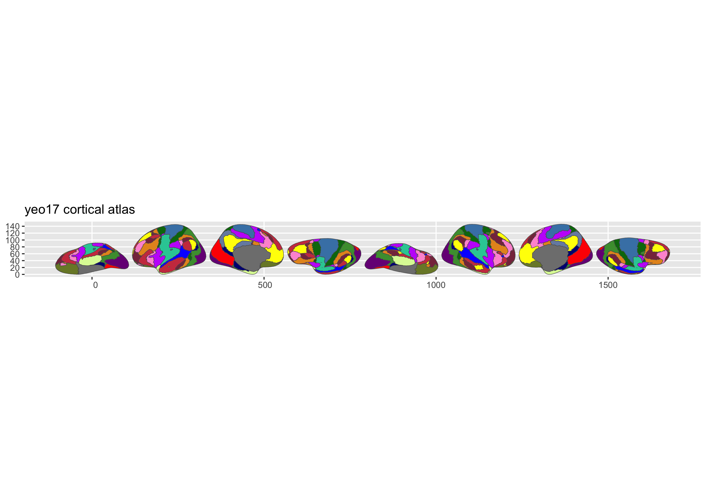

<!-- README.md is generated from README.qmd. Please edit that file -->

# ggsegYeo2011 

<!-- badges: start -->

[](https://github.com/ggsegverse/ggsegYeo2011/actions/workflows/R-CMD-check.yaml)
[](https://ggseg.r-universe.dev/ggsegYeo2011)
<!-- badges: end -->

This package contains dataset for plotting the Yeo 2011 cortical atlas
for ggseg.

## Installation

We recommend installing the ggseg-atlases through the ggseg
[r-universe](https://ggseg.r-universe.dev/ui#builds):

``` r
options(repos = c(
  ggseg = "https://ggseg.r-universe.dev",
  CRAN = "https://cloud.r-project.org"
))

install.packages("ggsegYeo2011")
```

You can install this package from [GitHub](https://github.com/) with:

``` r
# install.packages("pak")
pak::pak("ggsegverse/ggsegYeo2011")
```

## 7-network parcellation

``` r
library(ggseg)
library(ggsegYeo2011)

plot(yeo7())
```



## 17-network parcellation

``` r
plot(yeo17())
```



## Data source

Yeo BT, Krienen FM, Sepulcre J, Sabuncu MR, Lashkari D, Hollinshead M,
Roffman JL, Smoller JW, Zollei L, Polimeni JR, Fischl B, Liu H, Buckner
RL (2011). The organization of the human cerebral cortex estimated by
intrinsic functional connectivity. *J Neurophysiol*, 106(3):1125-65.
