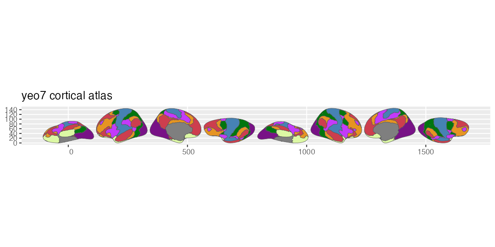
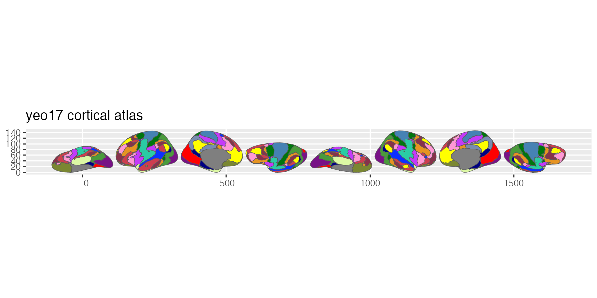

# ggsegYeo2011

<!-- badges: start -->
[](https://github.com/ggsegverse/ggsegYeo2011/actions/workflows/R-CMD-check.yaml)
[](https://ggsegverse.r-universe.dev/ggsegYeo2011)
<!-- badges: end -->

Yeo 2011 Atlas for the ggsegverse Ecosystem.

## Installation

``` r
# From r-universe
install.packages("ggsegYeo2011", repos = "https://ggsegverse.r-universe.dev")

# From GitHub
# install.packages("remotes")
remotes::install_github("ggsegverse/ggsegYeo2011")
```

## Usage

``` r
library(ggsegYeo2011)
library(ggseg)

plot(yeo7()) +
  theme_brain()
```

## Atlases

### yeo7

Yeo 2011 7-network resting-state parcellation (Yeo et al., 2011).



### yeo17

Yeo 2011 17-network resting-state parcellation (Yeo et al., 2011).



## Data source

Built-in FreeSurfer annotations (`Yeo2011_7Networks_N1000.annot`, `Yeo2011_17Networks_N1000.annot`) from the fsaverage5 subject.

- **Reference**: Yeo et al. (2011) [doi:10.1152/jn.00338.2011](https://doi.org/10.1152/jn.00338.2011)
- **Date obtained**: 2020-03-26 (FreeSurfer 7.4.1)
