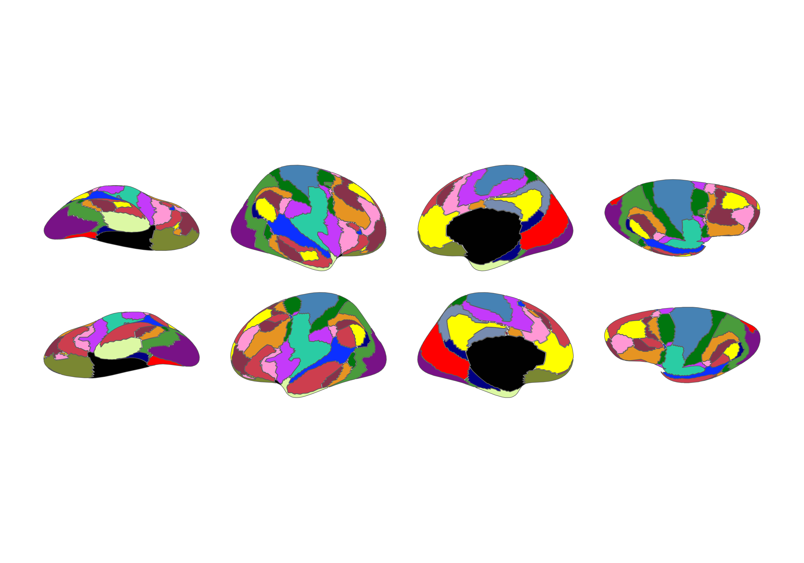

<!-- README.md is generated from README.qmd. Please edit that file -->

# ggsegYeo2011 

<!-- badges: start -->

[](https://github.com/LCBC-UiO/ggsegYeo2011/actions)
[](https://zenodo.org/badge/latestdoi/250192046)
[](https://CRAN.R-project.org/package=ggsegYeo2011)
[](https://github.com/ggsegverse/ggsegYeo2011/actions/workflows/R-CMD-check.yaml)
<!-- badges: end -->

This package contains dataset for plotting the Yeo2011 cortical atlas
for ggseg.

Yeo et al. (2011) J. Neurophysiology 16(3):1125-1165
[PubMed](https://www.ncbi.nlm.nih.gov/pubmed/21653723)

## Installation

We recommend installing the ggseg-atlases through the ggseg
[r-universe](https://ggseg.r-universe.dev/ui#builds):

``` r
options(repos = c(
  ggseg = "https://ggseg.r-universe.dev",
  CRAN = "https://cloud.r-project.org"
))

install.packages("ggsegYeo2011")
```

You can install from [GitHub](https://github.com/) with:

``` r
# install.packages("remotes")
remotes::install_github("LCBC-UiO/ggsegYeo2011")
```

## Example

``` r
library(ggsegYeo2011)
library(ggseg)
library(ggplot2)

ggplot() +
  geom_brain(
    atlas = yeo7(),
    mapping = aes(fill = label),
    position = position_brain(hemi ~ view),
    show.legend = FALSE
  ) +
  scale_fill_manual(values = yeo7()$palette, na.value = "grey") +
  theme_void()
```


``` r
ggplot() +
  geom_brain(
    atlas = yeo17(),
    mapping = aes(fill = label),
    position = position_brain(hemi ~ view),
    show.legend = FALSE
  ) +
  scale_fill_manual(values = yeo17()$palette, na.value = "grey") +
  theme_void()
```



Please note that the ‘ggsegYeo2011’ project is released with a
[Contributor Code of Conduct](CODE_OF_CONDUCT.md). By contributing to
this project, you agree to abide by its terms.
